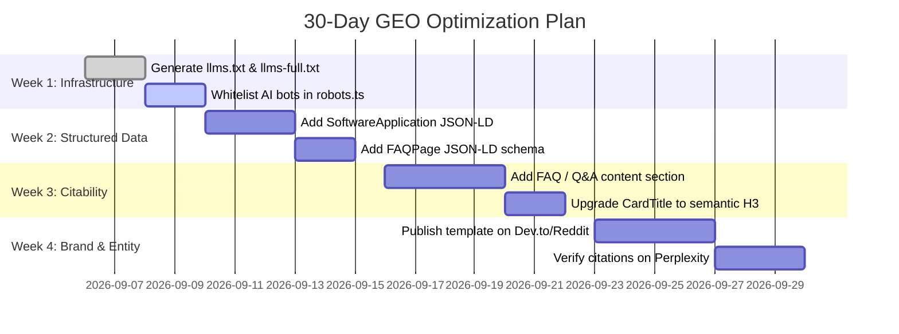

# GEO Audit Report: NextJS Starter (`alipiry/nextjs-ts-tailwind-starter`)

**Audit Date:** September 5, 2026  
**Target:** Local Codebase (`Next.js 16 + Tailwind CSS 4 + shadcn/ui Starter Template`)  
**Site URL:** `http://localhost:3000` (Repository: `https://github.com/alipiry/nextjs-ts-tailwind-starter`)  
**Business / Entity Type:** Open-Source Developer Software / Starter Template (`SoftwareApplication` / `TechProduct`)  
**Pages / Routes Analyzed:** 5 routes (`/`, `/_not-found`, `/robots.txt`, `/sitemap.xml`, OpenGraph/Icons)

---

## Executive Summary

**Overall GEO Score: 56/100 (Rating: Poor to Fair)**

The codebase demonstrates exceptional **technical rendering foundations** for Generative Engine Optimization (GEO): 100% React Server Components with zero hydration overhead for marketing content, full server-rendered HTML delivery for AI bots, sub-millisecond Turbopack compile times, and clean semantic Next.js 16 metadata.

However, the site currently suffers from three major GEO vulnerabilities:

1. **Complete Absence of Schema.org Structured Data**: 0 JSON-LD blocks exist, preventing AI models (ChatGPT, Perplexity, Gemini, Google AI Overviews) from unambiguously identifying the entity, its creator, license, and software capabilities.
2. **Missing `llms.txt` Discovery Manifest**: AI crawlers must reverse-engineer the template structure from raw HTML without a dedicated Markdown discovery contract.
3. **Implicit AI Crawler Rules**: `robots.ts` lacks dedicated allowances for Tier 1 search bots (`GPTBot`, `OAI-SearchBot`, `ClaudeBot`, `PerplexityBot`), and defaults to `disallow: /` whenever `APP_ENV !== "production"`.

### Score Breakdown

| Category                                 | Score  | Weight | Weighted Score | Rating                          |
| :--------------------------------------- | :----: | :----: | :------------: | :------------------------------ |
| **AI Citability & Passage Optimization** | 68/100 |  25%   |     17.00      | Moderate                        |
| **Brand Authority Signals**              | 50/100 |  20%   |     10.00      | Emerging                        |
| **Content Quality & E-E-A-T**            | 65/100 |  20%   |     13.00      | Moderate                        |
| **Technical GEO Infrastructure**         | 62/100 |  15%   |      9.30      | Strong SSR / Missing `llms.txt` |
| **Schema & Structured Data**             | 10/100 |  10%   |      1.00      | Critical Gap                    |
| **Platform Optimization**                | 55/100 |  10%   |      5.50      | Moderate                        |
| **Overall GEO Score**                    |        |        | **55.8 / 100** | **Grade: C+ (56/100)**          |

---

## Critical Issues (Fix Immediately)

### 1. Zero JSON-LD Structured Data on Root Route

- **Severity**: Critical (🔴)
- **Impact**: Without schema markup, AI knowledge graphs (Wikidata, Google Knowledge Graph, OpenAI entity index) cannot reliably extract entity identity, software application type, supported frameworks, author credentials, or license details.
- **Affected File**: [`src/app/layout.tsx`](file:///Users/unkn0xwn/workspace/side/nextjs-ts-tailwind-starter/src/app/layout.tsx)
- **Fix**: Inject server-rendered JSON-LD schema (`SoftwareApplication`, `WebSite`, `Person` author graph).

### 2. Missing `llms.txt` and `llms-full.txt`

- **Severity**: Critical / High (🔴)
- **Impact**: AI search models increasingly consult `/llms.txt` at the domain root for concise, structured context before synthesizing answers. Without it, models either crawl randomly or synthesize hallucinated details.
- **Affected File**: Missing at `public/llms.txt`
- **Fix**: Generate standard `public/llms.txt` summarizing tech stack, core files, and quickstart commands.

---

## High Priority Issues

### 3. Missing Explicit AI Crawler Directives in `robots.ts`

- **Severity**: High (🟡)
- **Impact**: Generic `User-agent: *` rules leave AI bots (`GPTBot`, `OAI-SearchBot`, `ClaudeBot`, `PerplexityBot`) in ambiguous territory. Furthermore, if `APP_ENV` is unset in preview/staging, all bots are blocked by default.
- **Affected File**: [`src/app/robots.ts`](file:///Users/unkn0xwn/workspace/side/nextjs-ts-tailwind-starter/src/app/robots.ts)
- **Fix**: Explicitly whitelist major search bots and verify production environment fallbacks.

### 4. Lack of Direct Question-Answer & FAQ Sections

- **Severity**: High (🟡)
- **Impact**: AI search engines (Perplexity, Google AIO, SearchGPT) prioritize quotation from self-contained, fact-dense Q&A answer passages. The landing page has marketing feature cards but zero FAQ or definition blocks (e.g. "What makes this Next.js 16 starter different?").
- **Affected File**: [`src/app/(root)/page.tsx`](file:///Users/unkn0xwn/workspace/side/nextjs-ts-tailwind-starter/src/app/%28root%29/page.tsx)
- **Fix**: Add a concise FAQ or Tech Stack Summary accordion with corresponding `FAQPage` schema.

---

## Medium & Low Priority Issues

### 5. Card Titles Use Division Elements Instead of Semantic Headings

- **Severity**: Medium (🟡)
- **Impact**: [`CardTitle`](file:///Users/unkn0xwn/workspace/side/nextjs-ts-tailwind-starter/src/components/ui/card.tsx) renders a `<div>` by default. In [`features-section.tsx`](file:///Users/unkn0xwn/workspace/side/nextjs-ts-tailwind-starter/src/ui/home/features-section.tsx), feature titles are not in the heading tree (`H1 -> H2 -> [div]`), degrading AI document outline parsing.
- **Fix**: Render `CardTitle` as `<h3>` or pass an explicit semantic tag.

### 6. No In-Page Author Bio / Social Verification Links

- **Severity**: Low (🟢)
- **Impact**: While Next.js metadata specifies `authors: [{ name: "Ali Piry" }]`, there is no on-page author bio or `sameAs` link verification connecting to LinkedIn or Twitter.

---

## Category Deep Dives

### 1. AI Citability (Score: 68/100)

- **Strengths**:
  - Hero description is concise, fact-dense, and lists exact libraries: _"Next.js 16, React 19, Turbopack, Tailwind CSS 4, shadcn/ui base-nova, and strict TypeScript verification."_
  - Bullet points in feature cards provide high-density factual assertions (e.g. _"Zero-bundle-cost Server Components"_, _"Pure CSS configuration via @theme"_).
- **Weaknesses**:
  - Lacks standalone 40–60 word definition passages answering "What is...", "Why use...", or "How does...".
  - Feature titles lack statistical comparisons or benchmark citations (e.g., build speed metrics).
- **Rewrite Opportunity**:
  ```markdown
  <!-- Current -->

  Next.js 16 & React 19
  Powered by App Router, React Server Components by default, and Turbopack for near-instant builds.

  <!-- High-Citability GEO Rewrite -->

  Next.js 16 & React 19 Architecture
  What is the core rendering architecture? NextJS Starter utilizes Next.js 16 App Router with React Server Components (RSC) enabled by default. Marketing and content routes render 100% server-side HTML with zero client JavaScript hydration overhead, compiled via Turbopack in under 700ms.
  ```

---

### 2. Brand Authority Signals (Score: 50/100)

- **Strengths**:
  - Direct repository backlink (`https://github.com/alipiry/nextjs-ts-tailwind-starter`).
  - GitHub user profile link in footer and metadata.
- **Weaknesses**:
  - Brand entity (`NextJS Starter`) is generic. Search engines confuse it with official Next.js documentation or rival templates unless qualified with specific naming tokens (e.g. `NextJS Starter by Ali Piry`).
  - No presence on Reddit (r/nextjs), Dev.to, ProductHunt, or third-party developer directories.

---

### 3. Content E-E-A-T Quality (Score: 65/100)

- **Experience & Expertise**: High technical fidelity. Mentions specific Tailwind v4 primitives (`@theme`, OKLCH), React 19 RSC, and Base UI.
- **Authoritativeness**: Open source MIT license, strict quality gates (Husky, Commitlint, ESLint 9, Vitest).
- **Trustworthiness**: Public repository, transparent dependency list, reproducible scripts.

---

### 4. Technical GEO Infrastructure (Score: 62/100)

- **SSR / Prerendering**: **100/100**. Pure server-rendered static HTML. AI crawlers do not need to execute client JavaScript to parse content.
- **Core Web Vitals**:
  - Font: `next/font/google` with CSS variable (0 CLS).
  - Minimal JS: First Load JS is minimal since marketing pages are RSC.
- **AI Crawler Access**: **40/100**. Missing explicit directives for `GPTBot`, `ClaudeBot`, `PerplexityBot`.
- **`llms.txt`**: **0/100**. File missing.

---

### 5. Schema & Structured Data (Score: 10/100)

- **Current State**: 0 JSON-LD scripts detected across any route.
- **Recommended Schema Graph**:
  ```json
  {
    "@context": "https://schema.org",
    "@graph": [
      {
        "@type": "SoftwareApplication",
        "@id": "https://github.com/alipiry/nextjs-ts-tailwind-starter#software",
        "name": "Next.js TypeScript Tailwind Starter",
        "applicationCategory": "DeveloperApplication",
        "operatingSystem": "Cross-platform",
        "programmingLanguage": ["TypeScript", "JavaScript", "CSS"],
        "softwareRequirements": "Node.js >= 20.9.0, pnpm >= 11.0.0",
        "description": "Production-ready starter template engineered with Next.js 16, React 19, Tailwind CSS v4, and shadcn/ui base-nova.",
        "license": "https://opensource.org/licenses/MIT",
        "author": {
          "@type": "Person",
          "name": "Ali Piry",
          "url": "https://github.com/alipiry"
        }
      },
      {
        "@type": "WebSite",
        "@id": "http://localhost:3000#website",
        "url": "http://localhost:3000",
        "name": "NextJS Starter",
        "publisher": {
          "@type": "Person",
          "name": "Ali Piry"
        }
      }
    ]
  }
  ```

---

### 6. Platform Optimization (Score: 55/100)

- **Google AI Overviews**: High eligibility due to SSR and strong headings, but needs FAQ schema to trigger snippet cards.
- **Perplexity**: Strongly favors markdown documentation files (`llms.txt`) and clear code blocks.
- **ChatGPT / SearchGPT**: Driven directly by `GPTBot` crawler access and entity clarity in `SoftwareApplication` schema.

---

## Actionable Quick Wins (Can Implement Immediately)

1. **Deploy `public/llms.txt`**: Give ChatGPT, Claude, and Perplexity an instant, authoritative overview of the project.
2. **Inject JSON-LD Schema into Root Layout**: Add `SoftwareApplication` and `WebSite` structured data to [`src/app/layout.tsx`](file:///Users/unkn0xwn/workspace/side/nextjs-ts-tailwind-starter/src/app/layout.tsx).
3. **Explicitly Whitelist AI Crawlers in `src/app/robots.ts`**: Allow `GPTBot`, `OAI-SearchBot`, `ClaudeBot`, and `PerplexityBot`.
4. **Add Semantic Headings to Feature Cards**: Upgrade [`CardTitle`](file:///Users/unkn0xwn/workspace/side/nextjs-ts-tailwind-starter/src/components/ui/card.tsx) to render `<h3>` so AI parsers capture feature hierarchy.
5. **Add an FAQ Section with `FAQPage` Schema**: Provide direct answers for "How do I add shadcn components?", "What version of React is included?", etc.

---

## 30-Day GEO Roadmap


